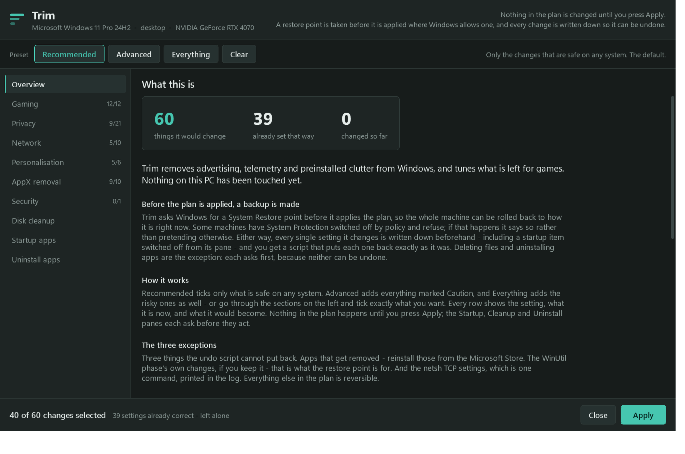
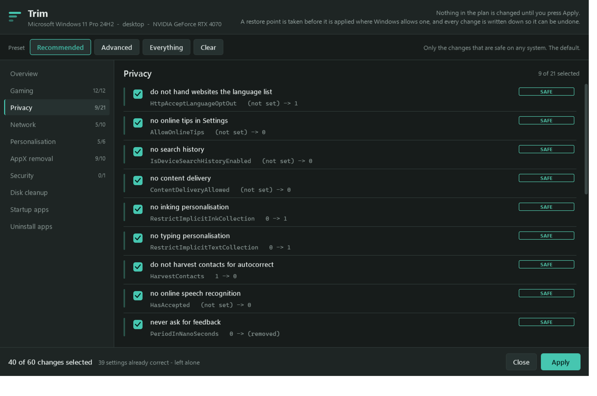
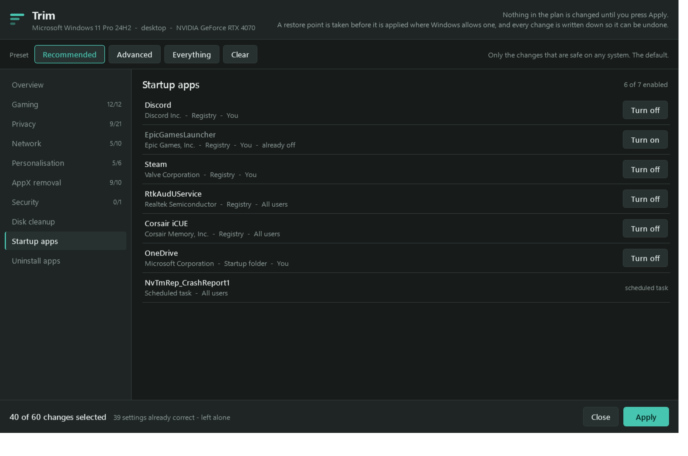
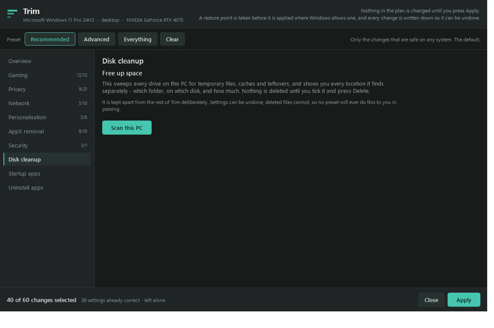
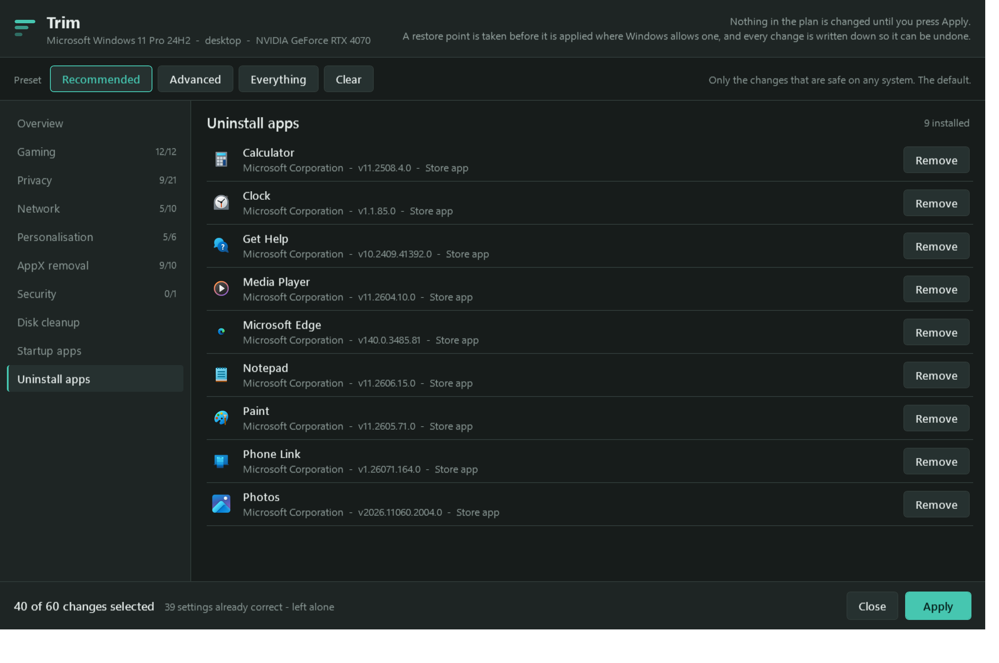

<div align="center">

# Trim

**Debloat Windows 10 and 11 without breaking it.**

Strips out ads, telemetry and preinstalled junk, tunes what's left for games,
and shows you every change before it makes one.

[](https://github.com/Glexxy/trim/actions/workflows/ci.yml)
[](LICENSE)
[](#requirements)
[](#undo)

```powershell
irm https://trimbloat.com/go | iex
```

Free, open source, nothing installed. &nbsp;·&nbsp; [trimbloat.com](https://trimbloat.com)

</div>



---

## What it does

**Removes the junk** — advertising ID, telemetry, activity history, suggested
content, Copilot, Widgets, Bing in Start, inking and typing collection, speech,
feedback prompts, and preinstalled apps. Edge too, if you want it: the browser
only, leaving WebView2 so apps that render with it keep working.

**Tunes for games** — Game Bar and background recording off, windowed-game
optimisations on, foreground CPU priority, hardware GPU scheduling, and every
installed game pointed at your real GPU. Steam, Epic, Xbox, GOG, EA, Ubisoft and
Battle.net libraries are all found. On NVIDIA it also applies a driver profile
composed for your exact card — a 5070 Ti gets multi-frame generation settings a
1660 doesn't, and sending the wrong ones makes the driver reject the lot.

**Clears disk space** — 13 categories across every drive, each itemised with its
size and location before anything goes. Plus a duplicate finder and a
report-only large-file scanner.

**Uninstalls properly** — runs the app's own uninstaller, then finds the
folders, registry keys, services and scheduled tasks it left behind. Registry
keys are exported to `.reg` first.

**Controls startup** — everything that runs at sign-in, from the Run keys, both
Startup folders and logon scheduled tasks, each with its publisher and where it
is configured.

Underneath: privacy, network, scheduled-task, service and performance phases,
plus the WinUtil tweak set ([credits](#credits)). Thirteen phases in total.

---

## Screenshots

<table>
<tr>
<td width="50%"></td>
<td width="50%"></td>
</tr>
<tr>
<td><b>Every change.</b> Setting, current value, new value, and a SAFE / CAUTION / RISKY label. Only SAFE is ticked on open.</td>
<td><b>Startup apps.</b> Publisher and origin for each — neither of which Task Manager shows.</td>
</tr>
<tr>
<td width="50%"></td>
<td width="50%"></td>
</tr>
<tr>
<td><b>Disk cleanup.</b> Every drive, itemised.</td>
<td><b>Deep uninstall.</b> The app, then what it left behind.</td>
</tr>
</table>

---

## Undo

Every registry write records the previous value first. At the end of the run —
including after a crash — that becomes a rollback script:

```
C:\ProgramData\Trim\undo\undo_<timestamp>.ps1
```

Run it whenever, and every value returns to exactly what it was. Values that
didn't exist before are removed, not zeroed.

A System Restore point is taken first. Startup shortcuts are moved, not deleted.
Registry keys are exported to `.reg` before a deep uninstall. NVIDIA's previous
profile is exported to `.nip`.

Three things it can't take back: removed Store apps, WinUtil's own changes (use
the restore point), and `netsh` TCP settings — one command, printed in the log.

## Safety

- Nothing changes until you click Apply. A run with no arguments always opens
  the window; applying without it takes an explicit `-Apply`.
- Admin is asked for once, at the start, because several of the values being
  read need it. `-DryRun` is the exception and grants nothing.
- Only SAFE is ticked by default. CAUTION and RISKY are opt-in.
- Camera, microphone, screenshots and screen recording are never touched —
  enforced at runtime and asserted by the tests.
- No BIOS, fan curves, undervolting or overclocking.
- Shared runtimes, winget and Xbox sign-in are protected from removal.
- Hardware and Windows version are detected, not assumed.
- No analytics, no account, no telemetry.

## Verifying it

**Read it** — served as plain text, not a download: <https://trimbloat.com/go>

**Check the fingerprint** — published at <https://trimbloat.com/sha256>, and
`-Version` prints the hash of the file on your machine.

**Build it yourself** — the build is reproducible, so the same commit gives
byte-identical output. CI checks this on every push.

```powershell
git clone https://github.com/Glexxy/trim
cd trim
.\build.ps1
```

Threat model and reporting: [SECURITY.md](SECURITY.md).

---

## Requirements

Windows 10 or 11, and Windows PowerShell 5.1 (ships with Windows) or
PowerShell 7+. Admin rights to apply changes; the dry run needs none.

## Usage

With no arguments it opens the window — which is what the one-liner does, and
nothing changes until you click Apply.

```powershell
.\trim.ps1
```

| Flag | |
|---|---|
| `-Apply` | Apply from the command line: no window, no prompt |
| `-DryRun` | Print the plan, change nothing |
| `-Gui` | Open the window (this is the default) |
| `-Skip Appx,Network` | Leave phases out |
| `-Only Gaming,Nvidia` | Run only those phases |
| `-Cleanup` | Include the disk cleanup scan |
| `-LargeFiles` | Report the biggest files on every drive |
| `-NoRestorePoint` | Skip the restore point |
| `-Version` | Print the version and this file's SHA256 |

---

## Credits

Trim's WinUtil phase invokes
**[WinUtil by Chris Titus Tech](https://github.com/ChrisTitusTech/winutil)** for
its tweak set rather than reimplementing it. That's one of thirteen phases; the
rest is Trim's own.

**[NVIDIA Profile Inspector](https://github.com/Orbmu2k/nvidiaProfileInspector)**
by Orbmu2k writes the driver profile, pinned by version and SHA256.

Licences: [NOTICE.md](NOTICE.md).

## Contributing

```powershell
.\test\Invoke-DryRunHarness.ps1
.\test\Test-UndoRoundTrip.ps1
.\test\Test-MainFlow.ps1
```

New registry writes need a `-Because` and a tier, plus `-MinBuild` / `-MaxBuild`
if the setting only exists on one Windows version. Source files must be UTF-8
with a BOM. The harness checks all of it, and CI runs on `windows-latest` under
Windows PowerShell 5.1.

Why the contested defaults are what they are: [docs/DECISIONS.md](docs/DECISIONS.md).

<details>
<summary>Layout</summary>

```
src/            numbered modules, concatenated in filename order
  01-header     param block, TLS, self-elevation
  02-core       logging, the undo ledger, the guarded registry writer
  03-detect     hardware and OS facts
  04..12        phases
  13-gui        the window
  14..19        performance, tasks, cleanup, uninstall, extras, startup
  99-main       orchestration
config/         winutil selection config
test/           harness, undo round-trip, GUI and VM verification
tools/          Repair-Encoding.ps1 - the build's encoding guard
docs/           design decisions, generated screenshots
hosting/        Cloudflare Worker, the site, publish script
build.ps1       concatenates src/ into trim.ps1
```

`irm | iex` fetches one file, so the modular source compiles into one script.
The build parses its own output and fails if it doesn't compile.

Screenshots are rendered from the running window by
`test\Export-GuiScreenshots.ps1`, against a demo machine — the Overview pane
otherwise prints the motherboard, BIOS version, disk models and volume labels of
whoever generated them. `-Real` renders your own.

</details>

## Licence

[MIT](LICENSE). Third-party components are separately licensed —
see [NOTICE.md](NOTICE.md).
